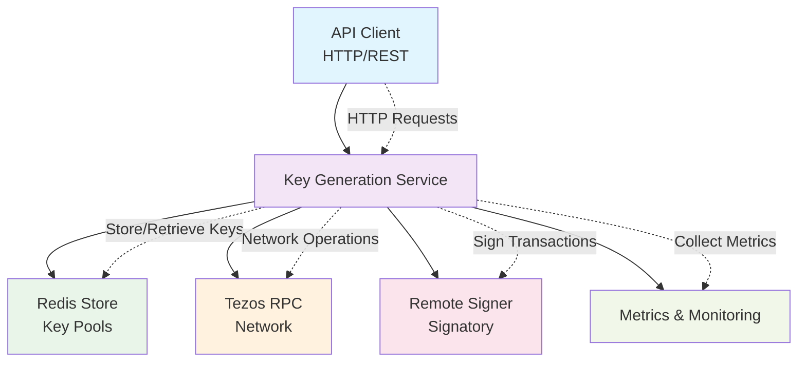

# Tezos Key Generation API

> ⚠️ **Documentation Status: Work in Progress** ⚠️
> 
> This documentation is currently being developed and may not be complete. Some sections may contain placeholder information or require additional details. We're actively working to improve and expand these docs. If you find any issues or have suggestions, please open an issue or contribute to the documentation.

A high-performance, Redis-backed API service for generating and managing Tezos cryptographic keys for integration testing and development environments.

## What It Does

The Tezos Key Generation API provides:

- **Automated Key Generation**: Creates batches of Tezos keys (secret/public key pairs) on demand
- **Key Pool Management**: Maintains pools of pre-generated keys for fast access
- **Multi-Network Support**: Supports multiple Tezos networks (ghostnet, rionet, seoulnet)
- **Ephemeral Keys**: Temporary keys with configurable expiration for testing
- **Funding Integration**: Automatically funds generated addresses with specified amounts
- **Redis Backend**: Fast, persistent storage for key management

## Architecture



## Quick Start

### Using Docker (Recommended)

```bash
# Pull the latest image
docker pull ghcr.io/ecadlabs/tezos-key-gen-api:latest

# Run with basic configuration
docker run -d \
  --name keygen \
  -p 3000:3000 \
  -p 3001:3001 \
  -e REDIS_HOST=localhost \
  -e REDIS_PASSWORD=password123 \
  ghcr.io/ecadlabs/tezos-key-gen-api:latest
```

### Local Development

```bash
# Install dependencies
npm install

# Build the project
npm run build

# Start the service
npm start
```

## Configuration

### Environment Variables

| Variable | Default | Description |
|----------|---------|-------------|
| `REDIS_HOST` | `localhost` | Redis server hostname |
| `REDIS_PORT` | `6379` | Redis server port |
| `REDIS_PASSWORD` | `password123` | Redis authentication password |
| `RPC_URL` | `https://ghostnet.ecadinfra.com` | Default Tezos RPC endpoint |
| `TARGET_BUFFER` | `100` | Target number of keys in pool |
| `BATCH_SIZE` | `20` | Number of keys to generate per batch |
| `FUNDING_AMOUNT` | `10` | Amount in tez to fund each address |

### Configuration Files

- **`pools-config.json`**: Network-specific pool configurations
- **`accounts-config.json`**: User account and network mappings
- **`ephemeral-config.json`**: Ephemeral key settings

## API Endpoints

### Key Management

- `POST /{network}` - Get a key from the pool (e.g., `POST /ghostnet`)
- `GET /{network}` - Get pool status and funding balance
- `POST /{network}/ephemeral` - Create a new ephemeral key
- `GET /{network}/ephemeral/{id}/keys/{key}` - Get ephemeral key details
- `POST /{network}/ephemeral/{id}/keys/{key}` - Sign data with ephemeral key

### Metrics

- `GET /metrics` - Prometheus metrics endpoint (port 3001)

### Authentication

All endpoints require Bearer token authentication:
```bash
curl -H "Authorization: Bearer taquito-example" \
     http://localhost:3000/ghostnet
```

## Supported Networks

- **Ghostnet**: `https://ghostnet.ecadinfra.com`
- **Rionet**: `http://ecad-tezos-rionet-rolling-1.i.ecadinfra.com`
- **Seoulnet**: `http://ecad-tezos-seoulnet-rolling-1.i.ecadinfra.com`

## Use Cases

- **Integration Testing**: Generate test keys for Tezos application testing
- **Development**: Create development wallets and addresses
- **QA Environments**: Provision test accounts with funding
- **Load Testing**: Generate large numbers of keys for performance testing

## Monitoring

The service exposes Prometheus metrics on port 3001:

- Key pool sizes
- Keys produced/issued counters
- Funding account balances
- HTTP request metrics

## Troubleshooting

### Common Issues

1. **Redis Connection Failures**
   - Ensure Redis is running and accessible
   - Check network connectivity between containers
   - Verify Redis credentials

2. **Key Generation Failures**
   - Check Tezos RPC endpoint accessibility
   - Verify remote signer (Signatory) is running
   - Ensure sufficient funding account balance

3. **Authentication Errors**
   - Verify Bearer token is valid
   - Check user account configuration in `accounts-config.json`

### Logs

Enable debug logging by setting log level to `debug` in your environment.

## Contributing

1. Fork the repository
2. Create a feature branch
3. Make your changes
4. Add tests if applicable
5. Submit a pull request

## License

ISC License - see LICENSE file for details.